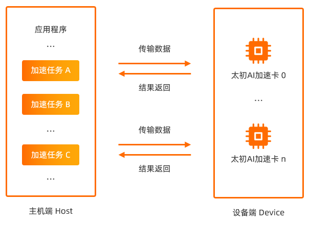
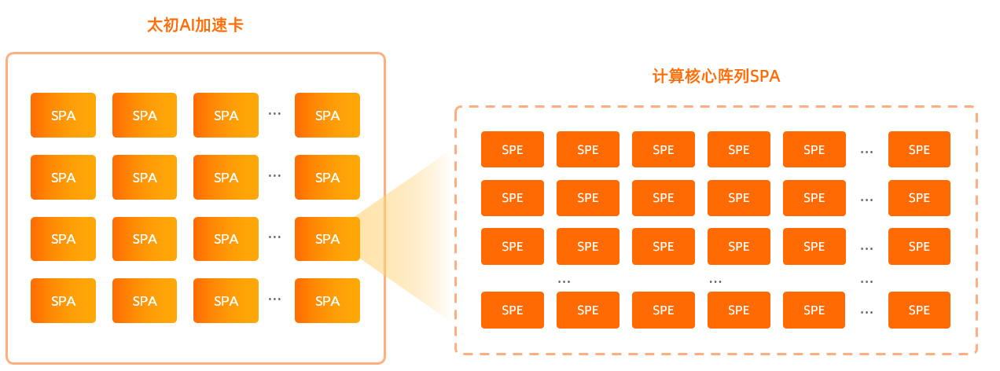
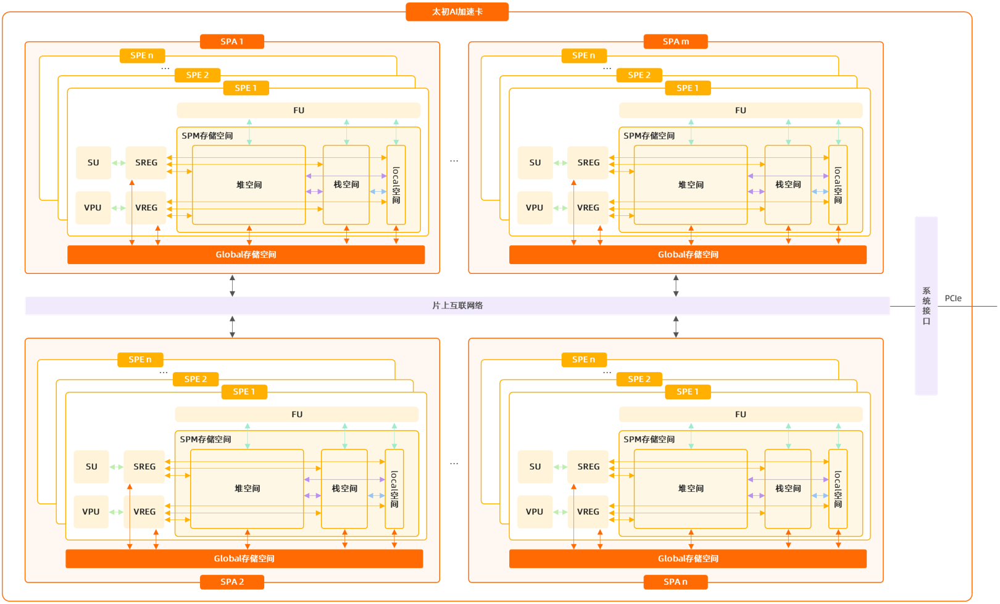
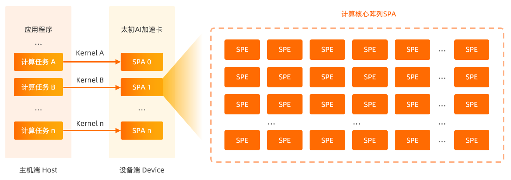
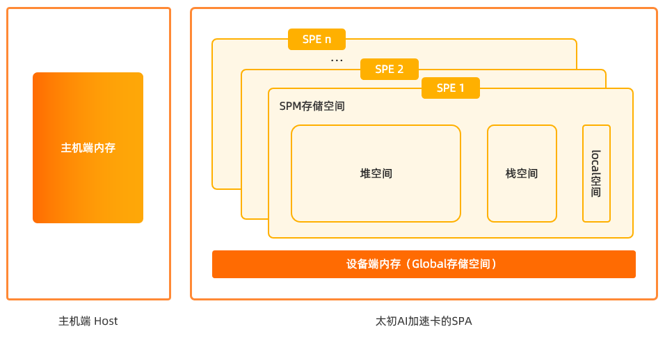
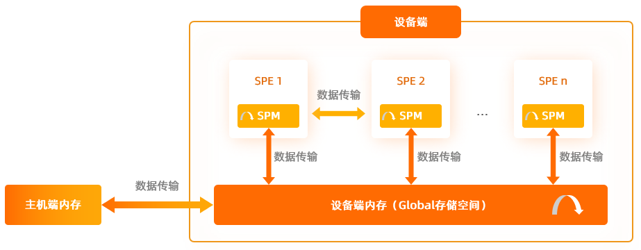

# 算子开发硬件相关知识

## 异构计算

CPU处理器体系偏向于快速的用户反馈和调度控制，但其计算能力有限。在面向高并发、大规模的数据计算时，需要使用异构计算模型对计算进行加速，从而节省用户大批量数据计算所消耗的时间。

SDAA C异构计算模型是将应用程序中大量的计算任务，由主机端发送到设备端的计算核心阵列SPA执行，充分利用太初AI加速卡的硬件资源，提高程序的运行速度，缩短程序的运行时间。

 

- 主机端（Host端）：由CPU构成，主要负责对设备端（Device端）内存资源的申请和释放，并控制设备端（Device端）处理任务的资源。

- 设备端（Device端）：由太初AI加速卡构成，负责处理大规模的数据运算。太初AI加速卡通过高效的运算部件（SPE）和访存部件（Global存储器等）弥补了通用处理器在处理高并发、大数据场景下计算和访存上的短板，提高了数据处理的效率。

  - 太初AI加速卡由计算核心阵列SPA（Synergistic Processor Element Array）和对应的Global高带宽存储器构成。

  - 每个计算核心阵列SPA是一个协从运算单元（每个SPA类似于GPU的一张卡，可以使用teco-smi查看SPA数量），由计算核心SPE（Synergistic Processor Element）构成。

 


## 硬件架构

太初AI加速卡由多个计算核心阵列SPA组成，每个计算核心阵列SPA由[threadDim](http://docs.tecorigin.com/release/sdaac/v3.1.0/?hash=2w1loxbyiaf3jy)个计算核心SPE和Global存储空间构成。每个计算核心SPE都拥有独立的计算、访存和控制功能，是一个独立的处理器核心，可以独立完成一个计算任务。每个计算核心SPE由FU、SU、SREG、VPU、VREG以及SPM存储空间组成。



### SU
SU（Scalar Unit）标量计算单元，用于执行标量运算的部件，可以完成算术运算、逻辑运算等标量运算。标量计算单元只能接收标量寄存器内的数据，在完成运算后将计算结果保存到标量寄存器内。

### SREG
SREG（Scalar Register）标量寄存器，用于存储标量数据的寄存器，支持单个数据元素的读写操作。标量寄存器可以与SPM存储空间和Global存储空间交换数据。

### VPU
VPU（Vector Processing Unit）向量处理单元，用于执行向量运算的部件，可以完成众多向量操作，包括向量存储操作、向量算术运算、向量类型转换、向量比较选择等。向量处理单元只能接受向量寄存器内的数据，在完成向量操作后将计算结果保存到向量寄存器内。

### VREG
VREG（Vector Register）向量寄存器，用于存储向量数据的专用寄存器，支持多个标量数据元素的并行读写操作。向量寄存器可以与SPM存储空间和Global存储空间交换数据。

### FU
FU（Function Unit）运算功能单元，可以完成矩阵乘等计算。运算功能单元只能接收SPM存储空间的数据，在完成运算后将计算结果保存到SPM存储空间。

### SPM存储空间
SPM存储空间是计算核心SPE内私有的存储空间，有较高的访存带宽，但是可用容量较小，需要合理利用有限的SPM存储空间以提升运行程序的性能。SDAA C将SPM存储空间进一步细分为：

- 堆空间：可以与FU、SREG、VREG、栈空间、local空间以及SPA内Global存储空间交换数据。
- 栈空间：可以与FU、SREG、VREG、堆空间、local空间以及SPA内Global存储空间交换数据。

  说明： 在开启`--stack-on-global`选项，将函数栈从SPM存储空间切换到Global存储空间后，切换后的栈空间可以与SREG、VREG、堆空间、local空间以及Global存储空间交换数据。
- local空间：可以与FU、SREG、VREG、堆空间、栈空间以及SPA内Global存储空间交换数据。

### Global存储空间
Global存储空间是计算核心阵列SPA内的内存空间，由计算核心阵列SPA内的所有计算核心SPE共享。Global存储空间有较大的存储容量，但是访存带宽较小，可以通过数据搬运接口将数据搬运到SPM存储空间内进行计算，以提升程序性能。Global存储空间可以与SREG、VREG、堆空间、栈空间以及local空间交换数据。


## SPMD（Single Program Multiple Data，单程序多数据）

SPMD（Single Program Multiple Data，单程序多数据），是一种用于任务并行的编程范式。其本质是将一个问题分解成若干个子问题，然后对其并行求解。

SDAA C遵循SPMD编程范式，同一计算核心阵列SPA内所有计算核心SPE运行同一份应用程序，每个SPE可以独立完成对子问题的并行求解。其核心在于对复杂计算任务的切分，并合理地将计算任务分配到不同的SPE内进行计算。

SDAA C提供了[threadIdx](http://docs.tecorigin.com/release/sdaac/v3.1.0/?hash=50v3qofpp8qt32)和[threadDim](http://docs.tecorigin.com/release/sdaac/v3.1.0/?hash=2w1loxbyiaf3jy)为每个SPE定制计算任务。其中：

- threadIdx：当前计算核心SPE的ID号，可以通过该关键字为目标SPE分配计算任务。
- threadDim：获取同一计算核心阵列SPA内计算核心SPE的总数。

以数组计算为例，将计算任务分配到同一SPA的所有SPE内并行执行：

```
using namespace sdaa;
#define SIZE 67

__device__ int g_data[SIZE];
__global__ void func()
{
    // 初始化原始数据
    for (int i = 0; i < SIZE; i++) {
        g_data[i] = i;
    }

    // SPE同步，确保所有的SPE都完成了数据的初始化
    sync_threads();

    // 可用的计算资源超过计算量时，每个SPE承担一次计算
    if (threadDim >= SIZE) {
        if (threadIdx < SIZE) {
            g_data[threadIdx]++;
        }
    } else {
        // 可用计算资源少于计算量时，每个SPE需承担多次计算
        // 例如当前计算量为67，假如共有32个SPE参与计算。则每个SPE需要至少承担两次计算任务
        int cal_time = SIZE / threadDim;
        for (int i = 0; i < cal_time; i++) {
            g_data[i * threadDim + threadIdx]++;
        }

        // 对于剩余的计算量使用部分SPE承担
        // 例如当前的计算量为67，共有32个SPE参与计算，每个SPE计算两次后，还剩余3次。则使用0， 1， 2三个SPE完成剩余的计算任务
        int remain_time = SIZE % threadDim;
        if ((threadIdx + 1) <= remain_time) {
            g_data[cal_time * threadDim + threadIdx]++;
        }
    }

    // SPE同步，确保所有的SPE都完成了子问题的求解
    sync_threads();

    // 打印输出计算结果
    for (int i = 0; i < SIZE; i++) {
        printf("SPE ID = %lu, g_data[%d] = %d\n", threadIdx, i, g_data[i]);
    }
}
```

## Kernel函数 

太初AI加速卡负责处理大规模的数据运算，计算核心SPE在SDAA C中相当于一个线程，用户可以使用SPE进行异构并行计算。

Kernel函数是由`__global__`关键字修饰的函数，在设备端执行（类似于线程代码）。在使用SDAA C时，主机端通过调用Kernel函数将大量的计算任务分配给SPE执行，从而提高数据的处理效率。



SDAA C编程语言：

- 通过`__global__`关键字标明Kernel函数，可参考[__global__](http://docs.tecorigin.com/release/sdaac/v3.1.0/?hash=3q81s6p06vm9q6)关键字。

- 在主程序中使用`<<<…>>>`语法调用Kernel函数，将计算任务发送到太初AI加速卡上执行计算，可参考[<<<...>>>](http://docs.tecorigin.com/release/sdaac/v3.1.0/?hash=2ntarb54legeyl)语法。

- 使用`threadIdx`标识执行计算的SPE，可参考[threadIdx关键字](http://docs.tecorigin.com/release/sdaac/v3.1.0/?hash=50v3qofpp8qt32)。

以执行加法为例的Kernel函数：
```
// Kernel函数
__global__ void user_kernel(int *a)
{
    int tid = threadIdx;
    // 每个SPE执行一个加法操作，threadDim个SPE完成threadDim个加法操作
    a[tid] = a[tid] + a[tid];
    return;
}
```

## 存储空间

SDAA C的存储空间分为主机端内存、设备端内存、计算核心SPE片上存储空间SPM。



### 主机端内存
主机端内存是主机端的存储空间，用于存储需要在设备端进行计算的源数据。

申请和释放主机端内存：可以使用malloc、free函数，可参考C/C++语言的相关内容。

### 设备端内存（Global存储空间）

设备端内存又称设备端Global存储空间，是计算核心阵列SPA的共享存储。在使用计算核心SPE进行计算前，需要先将数据从主机端传输到设备端的Global存储空间。

Global存储空间可以使用以下方法进行管理：

- 使用`__device__`关键字申请Global存储空间。
- 使用`sdaaMalloc`、`sdaaFree`申请和释放Global存储空间。

Global存储空间使用示例：

- 使用__device__关键字分配Global存储空间。
  ```
  // g_mem被创建在global存储空间内
  __device__ int g_mem = 1;
  ```
- 使用sdaaMalloc申请Global存储空间。

- 使用sdaaFree释放申请的Global存储空间。
  ```
  // 需要在Host端使用sdaaMalloc申请Global存储空间，使用sdaaFree释放申请的Global存储空间
  #define size 100;
  int main()
  {
      int *h_mem = NULL;
      // 为h_mem申请Global存储空间
      sdaaMalloc((void **)(&h_mem), size * sizeof(int));
  
      ...
  
      // 释放h_mem
      sdaaFree(h_mem);
  }
  ```
### SPM存储空间

每个计算核心SPE都有一块高速的片上本地局部数据存储空间SPM。SPM空间属于计算核心SPE的私有空间。对于计算核心SPE而言，访问Global存储空间，速度缓慢。在SPE执行计算任务的过程中，如果直接从SPM存储空间获取数据，计算效率将得到显著提升。

计算核心SPE运行时独占SPM存储空间，SPM存储空间可分为：

- 堆空间：需要手动管理的一块动态内存空间，您可以通过malloc接口分配堆内存空间，通过free接口释放所申请的堆内存空间。可通过`get_heap_size`接口查询当前计算核心SPE的堆空间总大小。

- 栈空间：程序运行时用于管理函数调用和局部变量的内存空间。可通过`get_stack_size`接口查询当前计算核心SPE的栈空间总大小。

- local空间：使用`__local__`关键字声明的空间，不支持变量初始化，可通过`get_local_size`接口查询当前计算核心SPE的local空间总大小。  

SPM存储空间使用示例：
```
// 使用__local__关键字分配local空间
__local__ int a;

__device__ void user_spm()
{
  // 变量b被分配到了user_spm函数的栈空间内
  int b = 1;
  
  // 使用malloc接口动态分配堆空间
  int *c = (int *)malloc(16 * sizeof(int));
  
  // 使用free接口释放所申请的堆空间
  free(c);
}
```

## 数据传输

数据传输管理主要包括：主机端内存与设备端内存（Global存储空间）之间的数据传递、同一计算核心阵列SPA的Global存储空间内的数据传递、Global存储空间与SPM存储空间之间的数据传递、同一计算核心阵列SPA内不同计算核心SPE之间SPM存储空间的数据传递、以及同一计算核心SPE的SPM存储空间内的数据传递。



### 主机端内存与Global存储空间之间的数据传递

Kernel函数在设备端运行时所需要的源数据，需要从主机端获取。在进行数据传输前，需要在设备端申请相应大小的Global存储空间，主机端将数据传输到已分配的Global存储空间，完成数据计算后，再将计算结果传回主机端内存，并释放申请的Global存储空间。具体可参考[sdaaMemcpy](http://docs.tecorigin.com/release/sdaac/v3.1.0/?hash=3bvf0ygscaypxa)。

### 同一计算核心阵列SPA的Global存储空间内的数据传递

同一计算核心阵列SPA内的Global存储空间和Global存储空间之间的数据传递，可参考[memcpy](http://docs.tecorigin.com/release/sdaac/v3.1.0/?hash=1mo4su2wzg21tr)。

### 不同计算核心SPE之间的数据传递

为使不同计算核心SPE之间的数据交换更加方便，SDAA C提供了RMA编程接口，用于搬运不同SPM存储空间之间的数据。RMA编程接口实现了计算核心SPE之间的高效数据搬运，且可以缓解SPM存储空间容量受限的问题，可参考[RMA数据搬运](http://docs.tecorigin.com/release/sdaac/v3.1.0/?hash=14iquedp6b414x)。

### 在同一计算核心SPE的SPM存储空间内的数据传递
计算核心SPE可在其内部的SPM空间进行数据传递，可参考[memcpy](http://docs.tecorigin.com/release/sdaac/v3.1.0/?hash=1mo4su2wzg21tr)。

